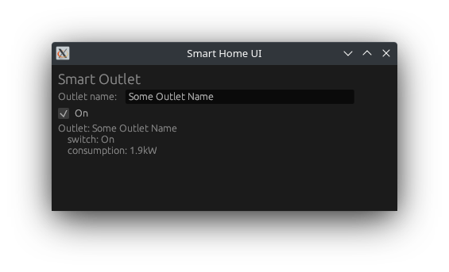

# Subprojects

## [fizzbuzz](./fizzbuzz)

A warm up. The main reason for this subproject is to get a feeling of what rust language and its ecosystem is.

```sh
$ cargo run --bin fizzbuzz
```

Output:

```
1
2
Fizz
4
Buzz
Fizz
...
```

## [patterns](./patterns)

A simple cli ray tracer.

Output

```
................................................................................
................................................................................
................................................................................
................................................................................
................................................................................
................................................................................
................................................................................
....................................................................**..........
.................................................................*********......
................................................................***********.....
...............................................................************.....
................................................................***********.....
....................................*********....................*********......
...................................***********..................................
                                  *************                                 
~~~~~~~~~~~~~~~~~~~~~~~~~~~~~~~~~~~***********~~~~~~~~~~~~~~~~~~~~~~~~~~~~~~~~~~
~~~~~~~*********~~~~~~~~~~~~~~~~~~~~*********~~~~~~~~~~~~~~~~~~~~~~~~~~~~~~~~~~~
~~~~~~***********~~~~~~~~~~~~~~~~~~~~~~~*~~~~~~~~~~~~~~~~~~~~~~~~~~~~~~~~~~~~~~~
~~~~~~************~~~~~~~~~~~~~~~~~~~~~~~~~~~~~~~~~~~~~~~~~~~~~~~~~~~~~~~~~~~~~~
~~~~~~***********~~~~~~~~~~~~~~~~~~~~~~~~~~~~~~~~~~~~~~~~~~~~~~~~~~~~~~~~~~~~~~~
~~~~~~~*********~~~~~~~~~~~~~~~~~~~~~~~~~~~~~~~~~~~~~~~~~~~~~~~~~~~~~~~~~~~~~~~~
~~~~~~~~~~~**~~~~~~~~~~~~~~~~~~~~~~~~~~~~~~~~~~~~~~~~~~~~~~~~~~~~~~~~~~~~~~~~~~~
~~~~~~~~~~~~~~~~~~~~~~~~~~~~~~~~~~~~~~~~~~~~~~~~~~~~~~~~~~~~~~~~~~~~~~~~~~~~~~~~
~~~~~~~~~~~~~~~~~~~~~~~~~~~~~~~~~~~~~~~~~~~~~~~~~~~~~~~~~~~~~~~~~~~~~~~~~~~~~~~~
~~~~~~~~~~~~~~~~~~~~~~~~~~~~~~~~~~~~~~~~~~~~~~~~~~~~~~~~~~~~~~~~~~~~~~~~~~~~~~~~
~~~~~~~~~~~~~~~~~~~~~~~~~~~~~~~~~~~~~~~~~~~~~~~~~~~~~~~~~~~~~~~~~~~~~~~~~~~~~~~~
~~~~~~~~~~~~~~~~~~~~~~~~~~~~~~~~~~~~~~~~~~~~~~~~~~~~~~~~~~~~~~~~~~~~~~~~~~~~~~~~
~~~~~~~~~~~~~~~~~~~~~~~~~~~~~~~~~~~~~~~~~~~~~~~~~~~~~~~~~~~~~~~~~~~~~~~~~~~~~~~~
~~~~~~~~~~~~~~~~~~~~~~~~~~~~~~~~~~~~~~~~~~~~~~~~~~~~~~~~~~~~~~~~~~~~~~~~~~~~~~~~
~~~~~~~~~~~~~~~~~~~~~~~~~~~~~~~~~~~~~~~~~~~~~~~~~~~~~~~~~~~~~~~~~~~~~~~~~~~~~~~~
Dummy (no origin)
DynDummy (no origin)
Disc (0.481521, 0.13467321, 0)
Disc (-0.4815208, -0.13467394, 0)
Disc (0, 0, 0)
Plane (0, 10, 0)
Plane (0, -10, 0)
```

## [patterns-2](./patterns-2)

```
Use ←↑↓→ keys to move around
Backspace returns you to the previous position
Esc - exit the game

                   ......
                   .    .
                .............
                .  .    .   .
              ...................@
              . .       .   .
              ...............
                .........
```


## [smart-home-1](./smart-home-1)

A basic implementation of smart devices that will be used in later parts of the course.

```sh
$ cargo run --bin smart-home-1
```

Output:

```
Outlet: Kitchen
    power: On
    consumptin: 4000.0kW
Thermometer: Outside
    temperature: 23.0°C
```


## [smart-home-2](./smart-home-2/)

A basic implementation of Smart Home infrastructure.

Output:

```
*** Report ***
    Smart home: Home, sweet home
        Room: Deep scary basement
            Outlet: Unknown outlet
                power: Off
                consumption: 0.0kW
            Thermometer: Unknown thermometer
                temperature: 5.0°C
        Room: Kitchen
            Outlet: Fridge
                power: On
                consumption: 4000.0kW
        Room: Living room
            Thermometer: Inside
                temperature: 23.0°C
            Thermometer: Outside
                temperature: -5.0°C

*** List of Rooms ***
Living room
Deep scary basement
Kitchen

*** List of devices from "Deep scary basement"***
Unknown outlet
Unknown thermometer

*** Please copy and paste it into a weakly report ***
Thermometer name: Unknown thermometer
temperature: 4.0°C

Device was not found
```

## [smart-home-3](./smart-home-3/)

The same as [smart-home-2](./smart-home-2/).

Use this commands to run examples:

```sh
$ cargo run --example home_report_v3
$ cargo run --example home_report_by
```

## [smart-home-4](./smart-home-4/)

The same as [smart-home-3](./smart-home-3/).

Use this commands to run examples:

```sh
$ cargo run --example home_report_v4
$ cargo run --example home_report_by_request_type
```

## [smart-home-5](./smart-home-5/)

Added Text-based user interface

Output:

```sh
1 - On
2 - Off
3 - Set power level
4 - Report
5 - Back
2
1 - On
2 - Off
3 - Set power level
4 - Report
5 - Back
4
Outlet: Some
    switch: Off
    consumption: 0.0kW
1 - On
2 - Off
3 - Set power level
4 - Report
5 - Back
1
1 - On
2 - Off
3 - Set power level
4 - Report
5 - Back
4
Outlet: Some
    switch: On
    consumption: 0.0kW
```

## [smart-home-6](./smart-home-6/)

Added TCP Mock Server and network interaction.

## [smart-home-10](./smart-home-10/)

Added support for HTTP server.

Potential output:

```sh
$ sh ./smart-home-10/client.sh 
Initial state:
Home: Home, sweet home

Added a new room:
Home: Home, sweet home
    Room: Some New Room

Added a new thermometer and outlet:
Home: Home, sweet home
    Room: Some New Room
        Outlet: Some New Outlet
            switch: Off
            consumption: 0.0kW
        Thermometer: Some New Thermometer
            temperature: 0.0°C

Shown a room:
Room: Some New Room
    Outlet: Some New Outlet
        switch: Off
        consumption: 0.0kW
    Thermometer: Some New Thermometer
        temperature: 0.0°C

Shown a device:
Outlet: Some New Outlet
    switch: Off
    consumption: 0.0kW

Removed a device:
Home: Home, sweet home
    Room: Some New Room
        Thermometer: Some New Thermometer
            temperature: 0.0°C

Removed a room:
Home: Home, sweet home
```

## [smart-home-11](./smart-home-11/)

Implemented GUI (egui).


